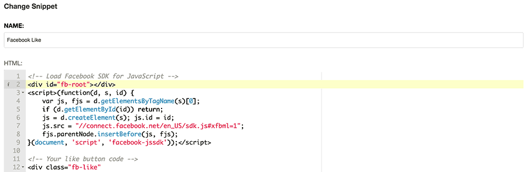

==================
django CMS Snippet
==================

|pypi| |build| |coverage|

**django CMS Snippet** provides a plugin for `django CMS <http://django-cms.org>`_
to inject HTML, CSS or JavaScript snippets into your website.

This addon is compatible with `Divio Cloud <http://divio.com>`_ and is also available on the
`django CMS Marketplace <https://marketplace.django-cms.org/en/addons/browse/djangocms-snippet/>`_
for easy installation.

We recommend using this plugin only during development::

    This plugin is a potential security hazard, since it allows authorized-
    users to place custom markup or Javascript on pages bypassing all of
    Django's normal sanitization mechanisms. This could be exploited by users
    with the right to add snippets to elevate their privileges to superusers.
    This plugin should only be used during the initial development phase for
    rapid prototyping and testing.

Contributing
============

This is a an open-source project. We'll be delighted to receive your
feedback in the form of issues and pull requests. Before submitting your
pull request, please review our `contribution guidelines
<http://docs.django-cms.org/en/latest/contributing/index.html>`_.

We're grateful to all contributors who have helped create and maintain this package.
Contributors are listed at the `contributors <https://github.com/divio/djangocms-snippet/graphs/contributors>`_
section.

One of the easiest contributions you can make is helping to translate this addon on
`Transifex <https://www.transifex.com/projects/p/djangocms-snippet/>`_.

Documentation
=============

See ``REQUIREMENTS`` in the `setup.py <https://github.com/divio/djangocms-snippet/blob/master/setup.py>`_
file for additional dependencies:

|python| |django| |djangocms|

Installation
------------

For a manual install:

* run ``pip install djangocms-snippet``
* add ``djangocms_snippet`` to your ``INSTALLED_APPS``
* run ``python manage.py migrate djangocms_snippet``

Configuration
-------------

To allow the contents of all snippets to be searchable, please set
``DJANGOCMS_SNIPPET_SEARCH`` to ``True`` in your settings::

    DJANGOCMS_SNIPPET_SEARCH = True

We are using `Ace <https://ace.c9.io/#nav=about>`_ as our editor of choice
to edit the snippet content. You can customize the
`theme <https://github.com/ajaxorg/ace/tree/master/lib/ace/theme>`_ and
`mode <https://github.com/ajaxorg/ace/tree/master/lib/ace/mode>`_ through::

    DJANGOCMS_SNIPPET_THEME = 'github'
    DJANGOCMS_SNIPPET_MODE = 'html'

If dynamic content is inserted (for example ````), the plugin cache must be disabled,
please set ``DJANGOCMS_SNIPPET_CACHE`` to ``False`` in your settings::

    DJANGOCMS_SNIPPET_CACHE = False # default value is True

Template tag
------------

You can also use a template tag to render a snippet rather than a plugin::

    
    

Replace ``[reference]`` with either:

* The snippet ID, e.g. ````
* The snippet slug, e.g. ````
* The snippet instance, e.g. ````

Optionally provide a fallback if there is no matching id/slug/instance::

    
        ... your content fallback here ...
    

Running Tests
-------------

You can run tests by executing::

    virtualenv env
    source env/bin/activate
    pip install -r tests/requirements.txt
    python setup.py test

.. |pypi| image:: https://badge.fury.io/py/djangocms-snippet.svg
    :target: http://badge.fury.io/py/djangocms-snippet
.. |build| image:: https://travis-ci.org/divio/djangocms-snippet.svg?branch=master
    :target: https://travis-ci.org/divio/djangocms-snippet
.. |coverage| image:: https://codecov.io/gh/divio/djangocms-snippet/branch/master/graph/badge.svg
    :target: https://codecov.io/gh/divio/djangocms-snippet

.. |python| image:: https://img.shields.io/badge/python-3.5+-blue.svg
    :target: https://pypi.org/project/djangocms-snippet/
.. |django| image:: https://img.shields.io/badge/django-2.2,%203.0,%203.1-blue.svg
    :target: https://www.djangoproject.com/
.. |djangocms| image:: https://img.shields.io/badge/django%20CMS-3.7%2B-blue.svg
    :target: https://www.django-cms.org/
